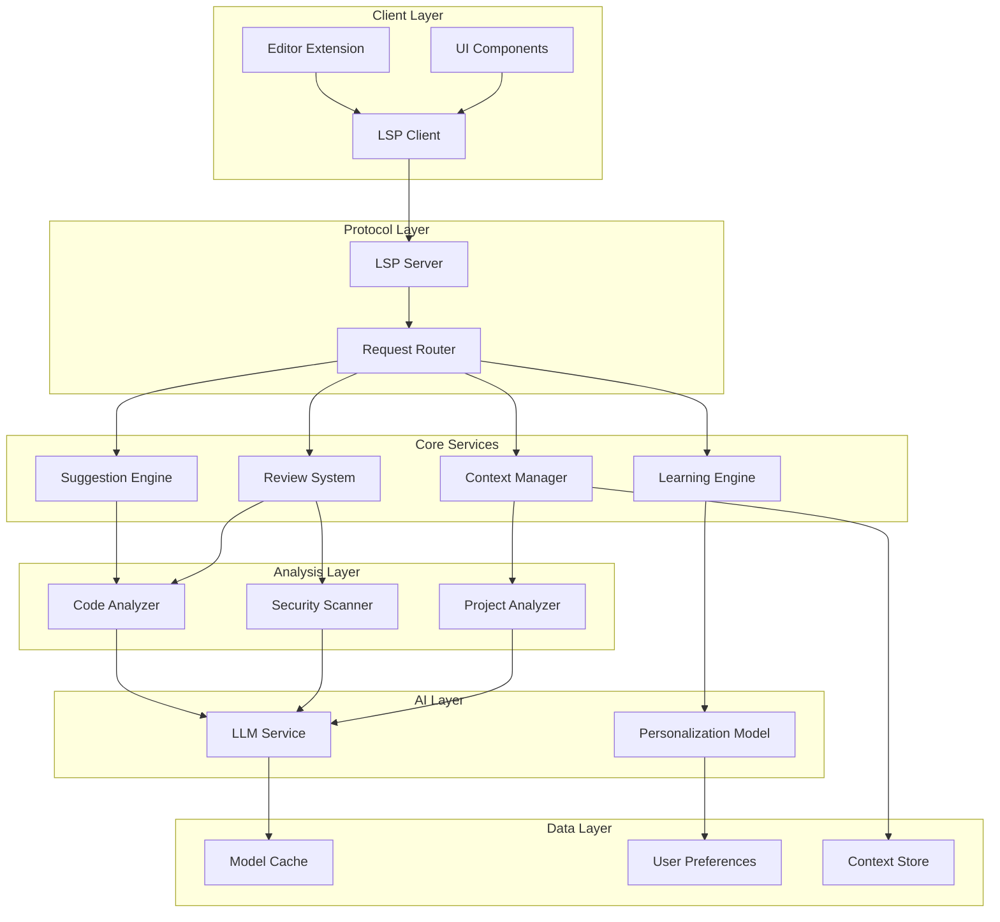

# Design Document: AI Pair Programmer

## Overview

The AI Pair Programmer is a sophisticated coding assistant that provides real-time, context-aware programming support through intelligent code suggestions, automated code review, and interactive assistance. The system leverages large language models (LLMs) and static analysis techniques to enhance developer productivity while maintaining code quality and security.

The architecture follows a modular, event-driven design that integrates seamlessly with existing development environments through the Language Server Protocol (LSP) and editor extensions. The system prioritizes low-latency responses (sub-200ms for simple completions) and maintains contextual awareness across the entire development session.

## Architecture

The system employs a layered architecture with clear separation of concerns:



### Key Architectural Principles

1. **Asynchronous Processing**: All AI operations run asynchronously to prevent blocking the user interface
2. **Caching Strategy**: Multi-level caching (in-memory, disk, distributed) for frequently accessed suggestions and analysis results
3. **Progressive Enhancement**: Core functionality works without AI, with AI features enhancing the experience
4. **Modular Design**: Each component can be independently updated, tested, and scaled

## Components and Interfaces

### Suggestion Engine

The Suggestion Engine provides real-time code completions and multi-line suggestions based on current context.

**Core Interface:**
```typescript
interface SuggestionEngine {
  generateCompletion(context: CodeContext, trigger: TriggerType): Promise<Suggestion[]>
  generateMultiLine(context: CodeContext, intent: string): Promise<MultiLineSuggestion>
  rankSuggestions(suggestions: Suggestion[], userPreferences: UserProfile): Suggestion[]
}

interface Suggestion {
  text: string
  confidence: number
  type: SuggestionType
  metadata: SuggestionMetadata
}
```

**Performance Requirements:**
- Simple completions: < 200ms response time
- Multi-line suggestions: < 1000ms response time
- Confidence scoring for all suggestions
- Support for streaming responses for long completions

### Review System

The Review System performs automated code analysis for quality, security, and style issues.

**Core Interface:**
```typescript
interface ReviewSystem {
  analyzeCode(code: string, language: string, context: ProjectContext): Promise<ReviewResult>
  detectSecurityIssues(code: string, context: SecurityContext): Promise<SecurityIssue[]>
  suggestRefactoring(code: string, patterns: CodePattern[]): Promise<RefactoringOption[]>
}

interface ReviewResult {
  issues: CodeIssue[]
  suggestions: ImprovementSuggestion[]
  metrics: CodeMetrics
  securityScore: number
}
```

**Analysis Capabilities:**
- Static analysis for common vulnerabilities (OWASP Top 10)
- Code complexity analysis and cyclomatic complexity calculation
- Style and convention checking based on project configuration
- Performance anti-pattern detection

### Context Manager

The Context Manager maintains awareness of project structure, coding patterns, and current development context.

**Core Interface:**
```typescript
interface ContextManager {
  analyzeProject(projectPath: string): Promise<ProjectContext>
  updateContext(event: CodeEvent): void
  getRelevantContext(position: CodePosition): Promise<RelevantContext>
  trackUserPatterns(userAction: UserAction): void
}

interface ProjectContext {
  structure: ProjectStructure
  dependencies: Dependency[]
  conventions: CodingConvention[]
  patterns: IdentifiedPattern[]
}
```

**Context Tracking:**
- File dependency analysis and import/export mapping
- Coding pattern recognition (naming conventions, architectural patterns)
- Cross-file relationship tracking
- Real-time context updates based on user actions

### Learning Engine

The Learning Engine adapts the system behavior based on user preferences and feedback.

**Core Interface:**
```typescript
interface LearningEngine {
  recordFeedback(suggestion: Suggestion, feedback: UserFeedback): void
  updateUserProfile(userId: string, action: UserAction): void
  personalizeResults(results: any[], userProfile: UserProfile): any[]
  analyzeUsagePatterns(userId: string): Promise<UsagePattern[]>
}

interface UserProfile {
  preferences: CodingPreferences
  patterns: PersonalPattern[]
  rejectionHistory: RejectionPattern[]
  acceptanceHistory: AcceptancePattern[]
}
```

## Data Models

### Core Data Structures

```typescript
// Code Context Model
interface CodeContext {
  filePath: string
  content: string
  cursorPosition: Position
  selection?: Range
  language: string
  projectContext: ProjectContext
  recentChanges: Change[]
}

// Suggestion Model
interface Suggestion {
  id: string
  text: string
  type: SuggestionType
  confidence: number
  reasoning: string
  alternatives: Alternative[]
  metadata: {
    source: string
    timestamp: number
    contextHash: string
  }
}

// Review Issue Model
interface CodeIssue {
  id: string
  type: IssueType
  severity: Severity
  location: Range
  message: string
  suggestion?: string
  autoFixable: boolean
  references: Reference[]
}

// User Interaction Model
interface UserAction {
  type: ActionType
  timestamp: number
  context: CodeContext
  suggestion?: Suggestion
  outcome: ActionOutcome
}
```

### Security and Privacy Models

```typescript
// Security Context
interface SecurityContext {
  sensitivePatterns: Pattern[]
  allowedLibraries: Library[]
  securityPolicies: Policy[]
  complianceRequirements: Requirement[]
}

// Privacy Protection
interface PrivacySettings {
  dataRetention: RetentionPolicy
  anonymization: AnonymizationLevel
  localProcessing: boolean
  cloudSync: boolean
}
```

## Correctness Properties

*A property is a characteristic or behavior that should hold true across all valid executions of a system—essentially, a formal statement about what the system should do. Properties serve as the bridge between human-readable specifications and machine-verifiable correctness guarantees.*

Now I need to analyze the acceptance criteria to determine which ones can be tested as properties. Let me use the prework tool to analyze the testability of each acceptance criterion.

Based on the prework analysis, I'll now convert the testable acceptance criteria into correctness properties:

### Property 1: Real-time Suggestion Performance
*For any* code context and typing event, when a suggestion is requested, the system should respond within 200ms for simple completions and provide contextually relevant suggestions with confidence indicators and alternatives.
**Validates: Requirements 1.1, 1.3, 7.1**

### Property 2: Multi-line Suggestion Timing
*For any* typing pause exceeding 500ms in an active session, the system should generate multi-line code suggestions based on the current context.
**Validates: Requirements 1.2**

### Property 3: Suggestion Integration Consistency
*For any* accepted suggestion and code context, integrating the suggestion should preserve code validity and syntax correctness.
**Validates: Requirements 1.4**

### Property 4: Learning Adaptation Behavior
*For any* consistent pattern of user feedback (accepts/rejects), the system should adapt future suggestions to align with user preferences and established coding patterns.
**Validates: Requirements 1.5, 5.1, 5.2, 5.3, 5.4, 5.5**

### Property 5: Comprehensive Code Analysis
*For any* code modification in an active session, the review system should analyze the changes and provide prioritized feedback on bugs, security issues, and style violations with explanations.
**Validates: Requirements 2.1, 2.2, 2.4, 2.5**

### Property 6: Refactoring Opportunity Detection
*For any* code pattern analysis, the system should identify refactoring and optimization opportunities when they exist.
**Validates: Requirements 2.3**

### Property 7: Context Consistency Management
*For any* project or context switch, the system should maintain accurate awareness of project structure, dependencies, coding patterns, and conventions, ensuring all suggestions respect established project guidelines.
**Validates: Requirements 3.1, 3.2, 3.3, 3.4, 3.5**

### Property 8: Interactive Assistance Completeness
*For any* developer question, code selection, or assistance request, the system should provide relevant, comprehensive responses including explanations, alternatives with trade-offs, and context-appropriate code generation.
**Validates: Requirements 4.1, 4.2, 4.3, 4.4, 4.5**

### Property 9: Security and Quality Enforcement
*For any* code suggestion or analysis, the system should ensure security best practices are followed, vulnerabilities are flagged with appropriate severity, and maintainable patterns are prioritized.
**Validates: Requirements 6.1, 6.2, 6.3, 6.4, 6.5**

### Property 10: System Performance Under Load
*For any* system load condition, the system should maintain responsive user interactions, provide progressive results for complex operations, gracefully degrade under heavy load, and prioritize user-facing requests.
**Validates: Requirements 7.2, 7.3, 7.4, 7.5**

### Property 11: Tool Integration Compatibility
*For any* development tool integration (editors, VCS, debuggers, linters), the system should maintain compatibility with standard features, understand tool-specific context, and coordinate to avoid conflicts.
**Validates: Requirements 8.1, 8.2, 8.3, 8.4, 8.5**

## Error Handling

The system implements comprehensive error handling across all components:

### Graceful Degradation Strategy

1. **AI Service Unavailable**: Fall back to cached suggestions and basic static analysis
2. **Network Connectivity Issues**: Use local models and cached data for core functionality
3. **High Latency**: Implement progressive loading and partial results display
4. **Memory Constraints**: Implement intelligent caching eviction and request throttling

### Error Recovery Mechanisms

```typescript
interface ErrorHandler {
  handleAIServiceError(error: AIServiceError): FallbackResponse
  handleNetworkError(error: NetworkError): CachedResponse
  handlePerformanceError(error: PerformanceError): DegradedResponse
  handleValidationError(error: ValidationError): UserFeedback
}
```

### User Feedback for Errors

- **Transparent Communication**: Clear error messages explaining what went wrong and what functionality is affected
- **Actionable Guidance**: Specific steps users can take to resolve issues or work around limitations
- **Progressive Enhancement**: Core functionality remains available even when advanced features fail

## Testing Strategy

The AI Pair Programmer requires a dual testing approach combining unit tests for specific scenarios and property-based tests for universal correctness guarantees.

### Property-Based Testing

**Framework Selection**: Use Hypothesis (Python) or fast-check (TypeScript) for property-based testing with minimum 100 iterations per test.

**Property Test Configuration**:
- Each correctness property maps to a single property-based test
- Tests generate random code contexts, user interactions, and system states
- Tag format: **Feature: ai-pair-programmer, Property {number}: {property_text}**

**Key Property Test Areas**:
1. **Suggestion Generation**: Test that all suggestions are valid, contextually appropriate, and include required metadata
2. **Performance Guarantees**: Verify response time requirements under various load conditions
3. **Learning Behavior**: Test adaptation patterns with simulated user feedback over time
4. **Security Validation**: Ensure all generated code follows security best practices
5. **Integration Consistency**: Verify compatibility across different development environments

### Unit Testing

**Focused Unit Test Areas**:
- **Edge Cases**: Empty files, malformed code, network timeouts
- **Integration Points**: LSP protocol compliance, editor API interactions
- **Security Scenarios**: Known vulnerability patterns, malicious input handling
- **Performance Boundaries**: Memory limits, concurrent request handling

**Test Data Management**:
- **Synthetic Code Generation**: Create diverse code samples for testing
- **Anonymized Real Data**: Use sanitized real-world code patterns (with privacy protection)
- **Security Test Cases**: Curated examples of common vulnerabilities and attack patterns

### Continuous Testing

**Automated Testing Pipeline**:
- **Pre-commit Hooks**: Run fast unit tests and basic property tests
- **CI/CD Integration**: Full test suite including extended property test runs
- **Performance Monitoring**: Continuous latency and throughput measurement
- **Security Scanning**: Regular vulnerability assessment of generated suggestions

**Quality Metrics**:
- **Suggestion Accuracy**: Percentage of accepted vs. rejected suggestions
- **Performance Compliance**: Response time distribution analysis
- **Security Coverage**: Percentage of security issues detected vs. missed
- **User Satisfaction**: Feedback analysis and usage pattern tracking