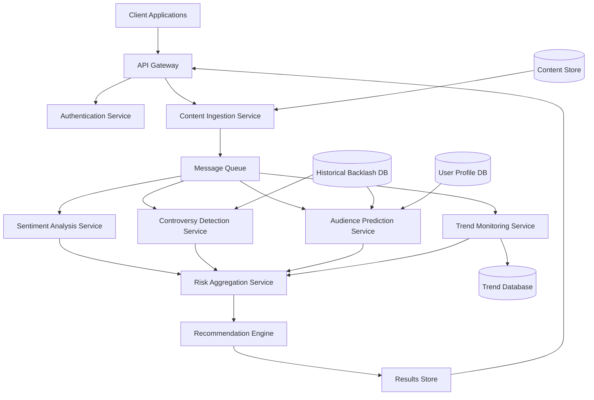

# Design Document: Content Backlash Prediction System

## Overview

The Content Backlash Prediction System is an AI-powered service that analyzes draft content before publication to predict potential audience backlash. The system combines multiple AI models including sentiment analysis, controversy detection, and audience reaction prediction to generate risk scores and actionable recommendations.

The system operates as a cloud-based service with a RESTful API, allowing integration into various content management workflows. It processes text, images, and video content, applying natural language processing (NLP), computer vision, and machine learning techniques to identify potential issues across political, cultural, social, religious, and ethical dimensions.

Key design principles:
- **Proactive Prevention**: Analyze before publication, not after
- **Explainability**: Provide clear reasoning for all predictions
- **Privacy-First**: Encrypt and protect all user content
- **Real-Time Context**: Incorporate current events and trending topics
- **Continuous Learning**: Improve predictions based on historical outcomes

## Architecture

The system follows a microservices architecture with the following major components:



### Component Responsibilities

1. **API Gateway**: Routes requests, handles rate limiting, manages API versioning
2. **Authentication Service**: Validates API keys, manages OAuth tokens, enforces access control
3. **Content Ingestion Service**: Validates content, extracts text from images/video, normalizes input
4. **Sentiment Analysis Service**: Analyzes emotional tone, detects sarcasm and irony
5. **Controversy Detection Service**: Identifies controversial elements across multiple dimensions
6. **Audience Prediction Service**: Predicts reactions based on audience profiles
7. **Trend Monitoring Service**: Tracks real-time trends and current events
8. **Risk Aggregation Service**: Combines scores from all analyzers into final risk score
9. **Recommendation Engine**: Generates actionable suggestions for content modification
10. **Results Store**: Caches analysis results for quick retrieval

## Components and Interfaces

### Content Ingestion Service

**Purpose**: Receive, validate, and prepare content for analysis

**Interface**:
```typescript
interface ContentSubmission {
  contentId: string;
  userId: string;
  contentType: 'text' | 'image' | 'video' | 'multimedia';
  textContent?: string;
  imageUrls?: string[];
  videoUrl?: string;
  targetPlatforms: Platform[];
  audienceProfile?: AudienceProfile;
  metadata: {
    submittedAt: Date;
    language: string;
  };
}

interface Platform {
  name: 'twitter' | 'instagram' | 'facebook' | 'linkedin' | 'youtube' | 'tiktok' | 'blog';
  accountHandle?: string;
}

interface AudienceProfile {
  demographics: {
    ageRange?: string;
    genderDistribution?: Record<string, number>;
    geographicRegions?: string[];
  };
  interests?: string[];
  politicalLeaning?: 'left' | 'center' | 'right' | 'mixed';
  sensitivityTopics?: string[];
}

function ingestContent(submission: ContentSubmission): Promise<ProcessingJob>;
function validateContent(submission: ContentSubmission): ValidationResult;
function extractTextFromMedia(mediaUrl: string, mediaType: 'image' | 'video'): Promise<string>;
```

**Processing Steps**:
1. Validate content is not empty and meets minimum requirements
2. Extract text from images using OCR (Optical Character Recognition)
3. Extract transcripts from video using speech-to-text
4. Normalize text (remove excessive whitespace, standardize encoding)
5. Create processing job and publish to message queue
6. Store original content in encrypted content store

### Sentiment Analysis Service

**Purpose**: Analyze emotional tone and detect potentially problematic sentiment

**Interface**:
```typescript
interface SentimentAnalysisResult {
  overallSentiment: 'positive' | 'negative' | 'neutral' | 'mixed';
  emotionalIntensity: number; // 0-10
  sentimentBySection: SectionSentiment[];
  problematicPhrases: ProblematicPhrase[];
  sarcasmDetected: boolean;
  implicitMeanings: ImplicitMeaning[];
}

interface SectionSentiment {
  sectionText: string;
  startIndex: number;
  endIndex: number;
  sentiment: 'positive' | 'negative' | 'neutral';
  intensity: number;
}

interface ProblematicPhrase {
  phrase: string;
  startIndex: number;
  endIndex: number;
  issue: string;
  severity: number; // 0-100
}

interface ImplicitMeaning {
  originalText: string;
  interpretedMeaning: string;
  riskOfMisinterpretation: number; // 0-100
}

function analyzeSentiment(content: string): Promise<SentimentAnalysisResult>;
function detectSarcasm(content: string): Promise<boolean>;
function identifyImplicitMeanings(content: string): Promise<ImplicitMeaning[]>;
```

**ML Models Used**:
- Transformer-based sentiment classifier (BERT/RoBERTa fine-tuned on social media data)
- Sarcasm detection model trained on labeled sarcastic content
- Contextual embedding model for implicit meaning detection

### Controversy Detection Service

**Purpose**: Identify controversial elements across multiple dimensions

**Interface**:
```typescript
interface ControversyAnalysisResult {
  controversyDimensions: ControversyDimension[];
  dogWhistles: DogWhistle[];
  culturalSensitivities: CulturalSensitivity[];
  currentEventReferences: CurrentEventReference[];
  overallControversyScore: number; // 0-100
}

interface ControversyDimension {
  dimension: 'political' | 'cultural' | 'social' | 'religious' | 'ethical';
  severityScore: number; // 0-100
  triggeredBy: string[]; // phrases or elements that triggered this dimension
  explanation: string;
}

interface DogWhistle {
  phrase: string;
  impliedMeaning: string;
  targetGroups: string[];
  severity: number; // 0-100
}

interface CulturalSensitivity {
  culturalReference: string;
  affectedCultures: string[];
  issueType: 'appropriation' | 'stereotype' | 'insensitivity' | 'misrepresentation';
  severity: number; // 0-100
}

interface CurrentEventReference {
  eventDescription: string;
  currentSentiment: 'positive' | 'negative' | 'polarized';
  riskLevel: number; // 0-100
  trendingOn: Platform[];
}

function detectControversy(content: string, context: AnalysisContext): Promise<ControversyAnalysisResult>;
function identifyDogWhistles(content: string): Promise<DogWhistle[]>;
function checkCulturalSensitivity(content: string): Promise<CulturalSensitivity[]>;
function crossReferenceCurrentEvents(content: string, trendData: TrendData): Promise<CurrentEventReference[]>;
```

**Data Sources**:
- Historical backlash database (incidents categorized by dimension)
- Cultural sensitivity knowledge base
- Real-time trend monitoring data
- News API for current events

### Audience Prediction Service

**Purpose**: Predict how specific audiences will react to content

**Interface**:
```typescript
interface AudiencePredictionResult {
  reactionDistribution: {
    positive: number; // percentage 0-100
    negative: number; // percentage 0-100
    neutral: number; // percentage 0-100
  };
  negativeSegments: AudienceSegment[];
  platformSpecificPredictions: PlatformPrediction[];
  confidenceLevel: number; // 0-100
}

interface AudienceSegment {
  segmentDescription: string;
  estimatedSize: number; // percentage of total audience
  predictedReaction: 'positive' | 'negative' | 'neutral';
  reasoningFactors: string[];
}

interface PlatformPrediction {
  platform: Platform;
  riskScore: number; // 0-100
  platformSpecificIssues: string[];
  audienceCharacteristics: string[];
}

function predictAudienceReaction(
  content: string,
  audienceProfile: AudienceProfile | null,
  platforms: Platform[]
): Promise<AudiencePredictionResult>;

function segmentAudience(audienceProfile: AudienceProfile): AudienceSegment[];
function predictPlatformReaction(content: string, platform: Platform): Promise<PlatformPrediction>;
```

**Prediction Approach**:
- Use collaborative filtering based on similar audience profiles
- Apply platform-specific reaction models
- Consider demographic factors (age, location, interests)
- Weight predictions by historical accuracy

### Trend Monitoring Service

**Purpose**: Track real-time trends and current events to provide context

**Interface**:
```typescript
interface TrendData {
  trendingTopics: TrendingTopic[];
  controversialPhrases: ControversialPhrase[];
  lastUpdated: Date;
}

interface TrendingTopic {
  topic: string;
  platforms: Platform[];
  sentiment: 'positive' | 'negative' | 'polarized' | 'neutral';
  volume: number; // mentions per hour
  relatedKeywords: string[];
  contextSummary: string;
}

interface ControversialPhrase {
  phrase: string;
  reason: string;
  severity: number; // 0-100
  firstDetected: Date;
}

function getCurrentTrends(): Promise<TrendData>;
function checkContentAgainstTrends(content: string, trends: TrendData): TrendMatchResult[];
function updateTrendDatabase(): Promise<void>;
```

**Update Frequency**: Every 15 minutes

**Data Sources**:
- Twitter API (trending topics, hashtags)
- Reddit API (trending subreddits, posts)
- News APIs (breaking news, controversial stories)
- Google Trends API

### Risk Aggregation Service

**Purpose**: Combine scores from all analyzers into a final risk assessment

**Interface**:
```typescript
interface RiskAssessment {
  riskScore: number; // 0-100
  riskCategory: 'Low' | 'Moderate' | 'High' | 'Critical';
  confidenceLevel: number; // 0-100
  contributingFactors: ContributingFactor[];
  breakdown: RiskBreakdown;
}

interface ContributingFactor {
  factor: string;
  impact: number; // contribution to overall score
  severity: number; // 0-100
  source: 'sentiment' | 'controversy' | 'audience' | 'trends';
}

interface RiskBreakdown {
  sentimentScore: number;
  controversyScore: number;
  audienceRiskScore: number;
  trendRiskScore: number;
  weights: {
    sentiment: number;
    controversy: number;
    audience: number;
    trends: number;
  };
}

function aggregateRisk(
  sentimentResult: SentimentAnalysisResult,
  controversyResult: ControversyAnalysisResult,
  audienceResult: AudiencePredictionResult,
  trendMatches: TrendMatchResult[]
): RiskAssessment;

function calculateRiskScore(breakdown: RiskBreakdown): number;
function categorizeRisk(score: number): 'Low' | 'Moderate' | 'High' | 'Critical';
function determineConfidence(results: AnalysisResults): number;
```

**Risk Calculation Formula**:
```
RiskScore = (
  sentimentScore * 0.25 +
  controversyScore * 0.35 +
  audienceRiskScore * 0.25 +
  trendRiskScore * 0.15
)

Where:
- sentimentScore: derived from emotional intensity and negative sentiment
- controversyScore: maximum severity across all controversy dimensions
- audienceRiskScore: percentage predicted negative reaction
- trendRiskScore: severity of trend matches
```

**Risk Categories**:
- Low (0-25): Minimal risk, safe to publish
- Moderate (26-50): Some concerns, review recommendations
- High (51-75): Significant risk, strongly consider modifications
- Critical (76-100): Very high risk, do not publish without major changes

### Recommendation Engine

**Purpose**: Generate actionable suggestions for reducing backlash risk

**Interface**:
```typescript
interface RecommendationSet {
  recommendations: Recommendation[];
  prioritizedByImpact: Recommendation[];
  estimatedRiskReduction: number; // if all recommendations applied
}

interface Recommendation {
  id: string;
  type: 'word_replacement' | 'phrase_modification' | 'content_addition' | 'content_removal' | 'tone_adjustment';
  originalText: string;
  suggestedText: string;
  reason: string;
  estimatedImpact: number; // potential risk score reduction
  affectedRiskFactors: string[];
}

function generateRecommendations(
  content: string,
  riskAssessment: RiskAssessment,
  analysisResults: AllAnalysisResults
): Promise<RecommendationSet>;

function prioritizeRecommendations(recommendations: Recommendation[]): Recommendation[];
function estimateImpact(recommendation: Recommendation, currentRisk: RiskAssessment): number;
function applyRecommendation(content: string, recommendation: Recommendation): string;
```

**Recommendation Strategies**:
1. **Word Replacement**: Replace inflammatory or problematic words with neutral alternatives
2. **Phrase Modification**: Rephrase sentences to reduce ambiguity or offense
3. **Content Addition**: Add context, disclaimers, or clarifications
4. **Content Removal**: Remove unnecessary controversial elements
5. **Tone Adjustment**: Soften aggressive or confrontational language

**Minimum Recommendations**: At least 3 for Moderate risk, at least 5 for High/Critical risk

## Data Models

### Content Submission Model
```typescript
interface ContentSubmission {
  contentId: string;
  userId: string;
  contentType: 'text' | 'image' | 'video' | 'multimedia';
  textContent?: string;
  imageUrls?: string[];
  videoUrl?: string;
  targetPlatforms: Platform[];
  audienceProfile?: AudienceProfile;
  metadata: {
    submittedAt: Date;
    language: string;
  };
}
```

### Analysis Result Model
```typescript
interface AnalysisResult {
  contentId: string;
  userId: string;
  submittedAt: Date;
  completedAt: Date;
  processingTimeMs: number;
  
  riskAssessment: RiskAssessment;
  sentimentAnalysis: SentimentAnalysisResult;
  controversyAnalysis: ControversyAnalysisResult;
  audiencePrediction: AudiencePredictionResult;
  trendMatches: TrendMatchResult[];
  recommendations: RecommendationSet;
  
  explanation: DetailedExplanation;
}

interface DetailedExplanation {
  summary: string;
  highlightedIssues: HighlightedIssue[];
  rationale: string;
  historicalComparisons: HistoricalComparison[];
}

interface HighlightedIssue {
  text: string;
  startIndex: number;
  endIndex: number;
  issueType: string;
  severity: number;
  explanation: string;
}

interface HistoricalComparison {
  similarIncident: string;
  outcome: string;
  similarity: number; // 0-100
  lessonsLearned: string;
}
```

### User Profile Model
```typescript
interface UserProfile {
  userId: string;
  email: string;
  accountType: 'creator' | 'brand' | 'pr_team' | 'public_figure';
  defaultAudienceProfile?: AudienceProfile;
  platforms: Platform[];
  preferences: {
    riskTolerance: 'conservative' | 'moderate' | 'aggressive';
    autoAnalyze: boolean;
    notificationSettings: NotificationSettings;
  };
  apiKeys: ApiKey[];
  usageStats: {
    analysesPerformed: number;
    lastAnalysisDate: Date;
  };
}

interface ApiKey {
  keyId: string;
  keyHash: string;
  createdAt: Date;
  lastUsed: Date;
  rateLimit: number; // requests per hour
}
```

### Historical Backlash Incident Model
```typescript
interface BacklashIncident {
  incidentId: string;
  contentSnapshot: string;
  platform: Platform;
  publishedAt: Date;
  backlashMetrics: {
    negativeComments: number;
    reportCount: number;
    unfollowCount: number;
    mediaAttention: boolean;
  };
  controversyDimensions: string[];
  lessonsLearned: string;
  severity: 'minor' | 'moderate' | 'major' | 'severe';
}
```

## Correctness Properties

*A property is a characteristic or behavior that should hold true across all valid executions of a system—essentially, a formal statement about what the system should do. Properties serve as the bridge between human-readable specifications and machine-verifiable correctness guarantees.*


### Property Reflection

After analyzing all acceptance criteria, I've identified several areas where properties can be consolidated:

**Consolidation Opportunities:**
1. Properties 2.2, 3.2, 5.1, 5.5 all test that numeric scores are within valid bounds (0-100 or 0-10). These can be combined into a single comprehensive "valid bounds" property.
2. Properties 1.3, 2.3, 4.5, 7.3 all test that for N inputs, we get N outputs. These can be combined into a single "output cardinality" property.
3. Properties 6.2 and 6.3 both test that recommendations have required fields. These can be combined into a single "recommendation completeness" property.
4. Properties 11.1 and 11.2 both test that results include explanatory information. These can be combined into a single "explanation completeness" property.

**Unique Properties Retained:**
- Input validation properties (1.1, 1.2) provide unique validation coverage
- Sentiment analysis properties (2.1, 2.4) test different aspects of sentiment detection
- Controversy detection properties (3.1, 3.3, 3.4) test different controversy dimensions
- Audience prediction properties (4.1, 4.2, 4.3, 4.4) test different prediction aspects
- Risk calculation properties (5.2, 5.3, 5.4) test different risk assessment aspects
- Recommendation properties (6.1, 6.4, 6.5) test different recommendation features
- Platform support properties (7.1, 7.2, 7.4) test different platform-specific behaviors
- Trend monitoring properties (10.2, 10.3, 10.5) test different trend-related features

### Correctness Properties

Property 1: Content Type Acceptance
*For any* valid content submission (text, image, video, or multimedia), the system should successfully accept and process the content without errors.
**Validates: Requirements 1.1**

Property 2: Empty Content Rejection
*For any* content submission with empty or whitespace-only text, the system should reject the submission with a validation error.
**Validates: Requirements 1.2**

Property 3: Multi-Component Analysis
*For any* content submission with N media components (text, images, videos), the analysis result should include analysis for all N components.
**Validates: Requirements 1.3**

Property 4: Valid Sentiment Classification
*For any* content analyzed, the overall sentiment should be exactly one of: positive, negative, neutral, or mixed.
**Validates: Requirements 2.1**

Property 5: Numeric Score Bounds
*For any* analysis result, all numeric scores (emotional intensity, severity scores, risk scores, confidence levels, percentages) should be within their specified valid ranges (0-10 for intensity, 0-100 for scores/percentages).
**Validates: Requirements 2.2, 3.2, 5.1, 5.5**

Property 6: Section-Level Sentiment Analysis
*For any* content with N paragraphs or sections, the sentiment analysis should provide sentiment results for all N sections.
**Validates: Requirements 2.3**

Property 7: Negative Sentiment Phrase Identification
*For any* content with negative overall sentiment, the analysis should identify at least one specific phrase or word contributing to the negative sentiment.
**Validates: Requirements 2.4**

Property 8: Controversy Dimension Coverage
*For any* content analyzed, the controversy analysis should evaluate and provide scores for all five dimensions: political, cultural, social, religious, and ethical.
**Validates: Requirements 3.1**

Property 9: Trend Cross-Reference
*For any* content that contains keywords matching a trending topic, the analysis should include that trending topic in the trend match results.
**Validates: Requirements 3.3**

Property 10: Cultural Reference Detection
*For any* content containing cultural references, the analysis should include cultural sensitivity evaluation for those references.
**Validates: Requirements 3.4**

Property 11: Audience Profile Impact
*For any* content analyzed with two different audience profiles, the audience reaction predictions should differ, demonstrating that the profile influences the prediction.
**Validates: Requirements 4.1**

Property 12: Reaction Distribution Completeness
*For any* audience prediction result, the sum of positive, negative, and neutral reaction percentages should equal 100.
**Validates: Requirements 4.2**

Property 13: Negative Segment Identification
*For any* audience prediction with negative reaction percentage above 30%, the result should identify at least one specific audience segment likely to react negatively.
**Validates: Requirements 4.3**

Property 14: Analysis Without Audience Profile
*For any* content submission without an audience profile, the system should successfully complete analysis using general population baseline.
**Validates: Requirements 4.4**

Property 15: Platform-Specific Predictions
*For any* content targeting N platforms, the analysis should provide N platform-specific predictions with separate risk scores.
**Validates: Requirements 4.5, 7.3**

Property 16: Risk Category Consistency
*For any* risk assessment, the risk category (Low/Moderate/High/Critical) should correctly correspond to the risk score range: Low (0-25), Moderate (26-50), High (51-75), Critical (76-100).
**Validates: Requirements 5.2**

Property 17: Risk Score Factor Sensitivity
*For any* content, if we modify any contributing factor (sentiment, controversy, audience, trends) while holding others constant, the final risk score should change, demonstrating all factors influence the score.
**Validates: Requirements 5.3**

Property 18: High-Risk Breakdown Detail
*For any* risk assessment with High or Critical category, the result should include a detailed breakdown with at least one contributing factor.
**Validates: Requirements 5.4**

Property 19: Minimum Recommendations for Risk
*For any* content with Moderate, High, or Critical risk score, the system should provide at least 3 actionable recommendations.
**Validates: Requirements 6.1**

Property 20: Recommendation Completeness
*For any* recommendation generated, it should include: original text, suggested text, reason for the change, and estimated impact value.
**Validates: Requirements 6.2, 6.3**

Property 21: Re-Analysis After Modification
*For any* content that receives recommendations, applying a recommendation and re-submitting should produce a new analysis result with a different (typically lower) risk score.
**Validates: Requirements 6.4**

Property 22: Recommendation Priority Ordering
*For any* set of recommendations, they should be ordered in descending order by estimated impact (highest impact first).
**Validates: Requirements 6.5**

Property 23: Platform Support Coverage
*For any* of the supported platforms (Twitter, Instagram, Facebook, LinkedIn, YouTube, TikTok, blog), content submitted for that platform should be successfully analyzed.
**Validates: Requirements 7.1**

Property 24: Platform-Specific Analysis Variation
*For any* content analyzed for two different platforms, the platform-specific predictions should differ in at least one aspect (risk score, issues, or audience characteristics).
**Validates: Requirements 7.2**

Property 25: Platform-Specific Issue Identification
*For any* platform prediction in a multi-platform analysis, the prediction should include platform-specific issue descriptions or indicate no platform-specific issues.
**Validates: Requirements 7.4**

Property 26: Historical Comparison Inclusion
*For any* content with High or Critical risk score, the analysis should include at least one historical comparison to similar past incidents.
**Validates: Requirements 8.2, 8.3**

Property 27: Negative Trend Risk Amplification
*For any* content, if it matches a trending topic with negative sentiment, the risk score should be higher than if it matched a trending topic with positive sentiment (all other factors equal).
**Validates: Requirements 10.3**

Property 28: Controversial Phrase Alerting
*For any* content containing phrases marked as currently controversial in the trend database, the analysis should include an alert about those phrases.
**Validates: Requirements 10.5**

Property 29: Explanation Completeness
*For any* analysis result, it should include a non-empty explanation with summary, rationale, and highlighted issues for any detected problems.
**Validates: Requirements 11.1, 11.2**

Property 30: API Response Format
*For any* successful API request, the response should be valid JSON that can be parsed without errors.
**Validates: Requirements 12.3**

## Error Handling

The system must handle various error conditions gracefully:

### Input Validation Errors
- **Empty Content**: Return 400 Bad Request with message "Content cannot be empty"
- **Invalid Content Type**: Return 400 Bad Request with message "Unsupported content type"
- **Missing Required Fields**: Return 400 Bad Request with specific field name
- **Content Too Large**: Return 413 Payload Too Large with size limits

### Authentication Errors
- **Missing API Key**: Return 401 Unauthorized with message "API key required"
- **Invalid API Key**: Return 401 Unauthorized with message "Invalid API key"
- **Expired Token**: Return 401 Unauthorized with message "Token expired"
- **Rate Limit Exceeded**: Return 429 Too Many Requests with retry-after header

### Processing Errors
- **Analysis Timeout**: Return 504 Gateway Timeout with message "Analysis took too long, please try again"
- **External Service Failure**: Return 503 Service Unavailable with message "Temporary service issue, please retry"
- **Model Inference Error**: Log error, return 500 Internal Server Error with generic message
- **Insufficient Data**: Return 200 with partial results and warning message

### Data Errors
- **Content Not Found**: Return 404 Not Found with message "Content ID not found"
- **User Not Found**: Return 404 Not Found with message "User ID not found"
- **Trend Data Stale**: Log warning, proceed with last known good data
- **Historical Data Missing**: Proceed without historical comparisons, note in response

### Error Response Format
```typescript
interface ErrorResponse {
  error: {
    code: string;
    message: string;
    details?: string;
    timestamp: Date;
    requestId: string;
  };
}
```

### Retry Strategy
- Transient errors (503, 504): Exponential backoff with max 3 retries
- Rate limit errors (429): Wait for retry-after duration
- Authentication errors (401): Do not retry, require user action
- Client errors (400, 404): Do not retry, fix request

### Graceful Degradation
- If trend monitoring is unavailable: Proceed without trend analysis, note in response
- If historical database is unavailable: Proceed without historical comparisons
- If one analysis component fails: Return partial results with warning
- If audience prediction fails: Use general population baseline

## Testing Strategy

The Content Backlash Prediction System requires comprehensive testing across multiple dimensions to ensure accuracy, reliability, and safety. We will employ a dual testing approach combining unit tests for specific scenarios and property-based tests for universal correctness guarantees.

### Testing Approach

**Unit Tests**: Focus on specific examples, edge cases, and integration points
- Specific content examples that should trigger certain risk levels
- Edge cases like empty content, extremely long content, special characters
- Error conditions and failure scenarios
- Integration between components (e.g., risk aggregation combining multiple scores)

**Property-Based Tests**: Verify universal properties across all inputs
- Generate random content with various characteristics
- Test that invariants hold across all generated inputs
- Verify mathematical properties (e.g., percentages sum to 100)
- Ensure bounds are respected (e.g., scores always 0-100)

Both approaches are complementary and necessary for comprehensive coverage. Unit tests catch concrete bugs and validate specific behaviors, while property tests verify general correctness across the input space.

### Property-Based Testing Configuration

**Library Selection**: 
- **TypeScript/JavaScript**: fast-check
- **Python**: Hypothesis
- **Java**: jqwik

**Test Configuration**:
- Minimum 100 iterations per property test (due to randomization)
- Each property test must reference its design document property
- Tag format: `Feature: content-backlash-prediction, Property {number}: {property_text}`

**Example Property Test Structure** (TypeScript with fast-check):
```typescript
import fc from 'fast-check';

describe('Content Backlash Prediction - Property Tests', () => {
  test('Property 5: Numeric Score Bounds', () => {
    // Feature: content-backlash-prediction, Property 5: Numeric Score Bounds
    fc.assert(
      fc.property(
        fc.record({
          text: fc.string({ minLength: 10, maxLength: 1000 }),
          contentType: fc.constantFrom('text', 'image', 'video'),
        }),
        async (content) => {
          const result = await analyzeContent(content);
          
          // All scores must be within bounds
          expect(result.sentimentAnalysis.emotionalIntensity).toBeGreaterThanOrEqual(0);
          expect(result.sentimentAnalysis.emotionalIntensity).toBeLessThanOrEqual(10);
          
          expect(result.riskAssessment.riskScore).toBeGreaterThanOrEqual(0);
          expect(result.riskAssessment.riskScore).toBeLessThanOrEqual(100);
          
          expect(result.riskAssessment.confidenceLevel).toBeGreaterThanOrEqual(0);
          expect(result.riskAssessment.confidenceLevel).toBeLessThanOrEqual(100);
          
          result.controversyAnalysis.controversyDimensions.forEach(dim => {
            expect(dim.severityScore).toBeGreaterThanOrEqual(0);
            expect(dim.severityScore).toBeLessThanOrEqual(100);
          });
        }
      ),
      { numRuns: 100 }
    );
  });

  test('Property 12: Reaction Distribution Completeness', () => {
    // Feature: content-backlash-prediction, Property 12: Reaction Distribution Completeness
    fc.assert(
      fc.property(
        fc.record({
          text: fc.string({ minLength: 10, maxLength: 1000 }),
          audienceProfile: fc.option(generateAudienceProfile()),
        }),
        async (content) => {
          const result = await analyzeContent(content);
          const distribution = result.audiencePrediction.reactionDistribution;
          
          const sum = distribution.positive + distribution.negative + distribution.neutral;
          expect(sum).toBeCloseTo(100, 1); // Allow 0.1% rounding error
        }
      ),
      { numRuns: 100 }
    );
  });

  test('Property 16: Risk Category Consistency', () => {
    // Feature: content-backlash-prediction, Property 16: Risk Category Consistency
    fc.assert(
      fc.property(
        fc.string({ minLength: 10, maxLength: 1000 }),
        async (text) => {
          const result = await analyzeContent({ text, contentType: 'text' });
          const score = result.riskAssessment.riskScore;
          const category = result.riskAssessment.riskCategory;
          
          if (score >= 0 && score <= 25) {
            expect(category).toBe('Low');
          } else if (score >= 26 && score <= 50) {
            expect(category).toBe('Moderate');
          } else if (score >= 51 && score <= 75) {
            expect(category).toBe('High');
          } else if (score >= 76 && score <= 100) {
            expect(category).toBe('Critical');
          }
        }
      ),
      { numRuns: 100 }
    );
  });
});
```

### Test Coverage Requirements

**Component-Level Testing**:
- Sentiment Analysis Service: 90%+ code coverage
- Controversy Detection Service: 90%+ code coverage
- Audience Prediction Service: 85%+ code coverage
- Risk Aggregation Service: 95%+ code coverage
- Recommendation Engine: 85%+ code coverage

**Integration Testing**:
- End-to-end API tests for all major workflows
- Test data flow through entire pipeline
- Test error propagation and handling
- Test concurrent request handling

**Performance Testing**:
- Load testing: 1000 concurrent requests
- Latency testing: 95th percentile < 5 seconds
- Stress testing: Graceful degradation under load

### Test Data Strategy

**Synthetic Test Data**:
- Generate content with known characteristics
- Create content that should trigger specific risk levels
- Build audience profiles with diverse demographics

**Real-World Test Data**:
- Historical backlash incidents (anonymized)
- Public social media posts with known outcomes
- Content from various domains and platforms

**Adversarial Test Data**:
- Edge cases: extremely long content, special characters, multiple languages
- Boundary cases: content at risk score boundaries
- Malicious inputs: injection attempts, malformed data

### Continuous Testing

**Pre-Deployment Testing**:
- All unit tests must pass
- All property tests must pass (100 iterations each)
- Integration tests must pass
- Performance benchmarks must meet targets

**Post-Deployment Monitoring**:
- Track prediction accuracy against actual outcomes
- Monitor false positive/negative rates
- A/B test model improvements
- Collect user feedback on prediction quality

### Model Validation

**Accuracy Metrics**:
- Precision: % of predicted backlash that actually occurred
- Recall: % of actual backlash that was predicted
- F1 Score: Harmonic mean of precision and recall
- Target: F1 > 0.75 for High/Critical risk predictions

**Bias Testing**:
- Test for demographic bias in predictions
- Ensure fair treatment across cultural contexts
- Validate against diverse content types and creators

**Calibration Testing**:
- Verify confidence levels match actual accuracy
- Test that 80% confidence predictions are correct 80% of the time
- Recalibrate models when drift is detected
